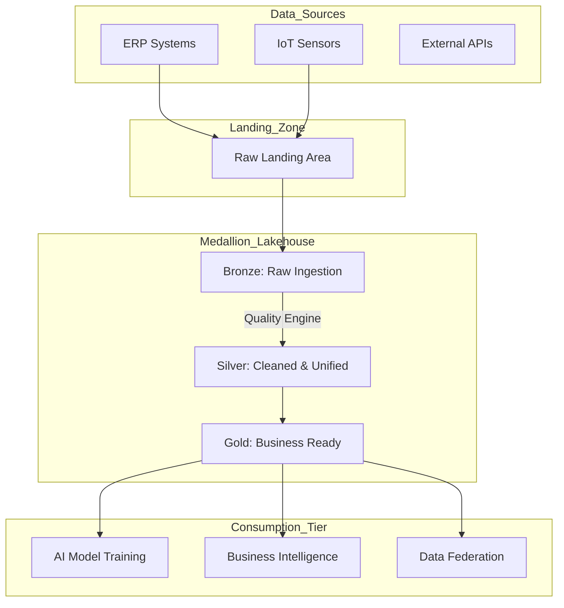
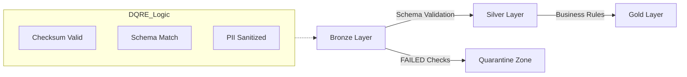
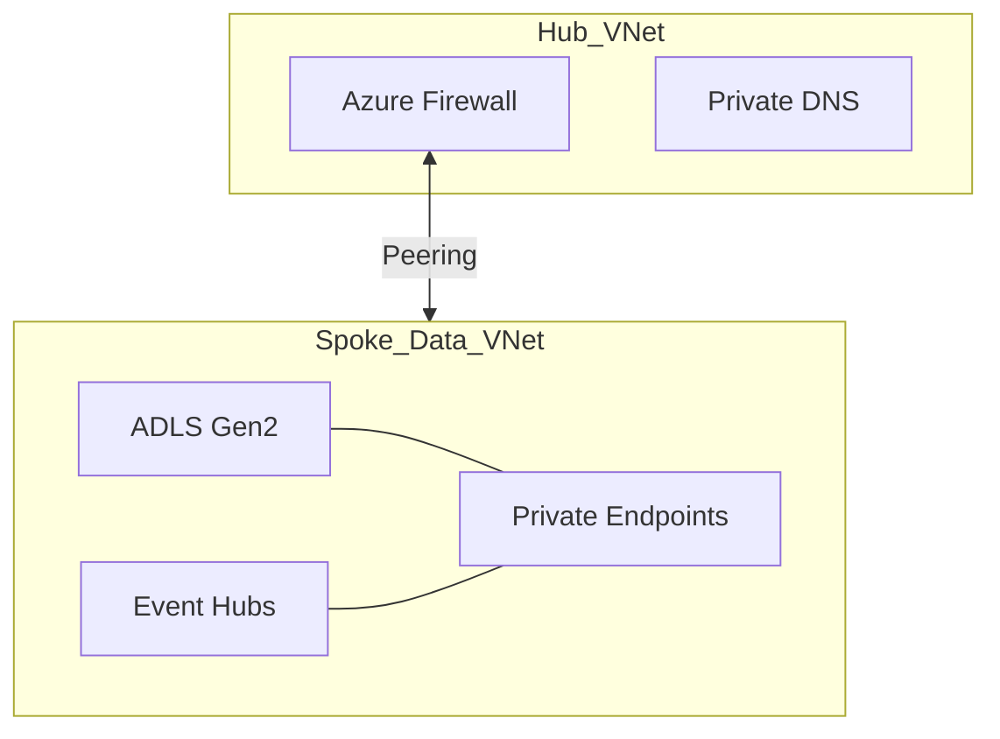
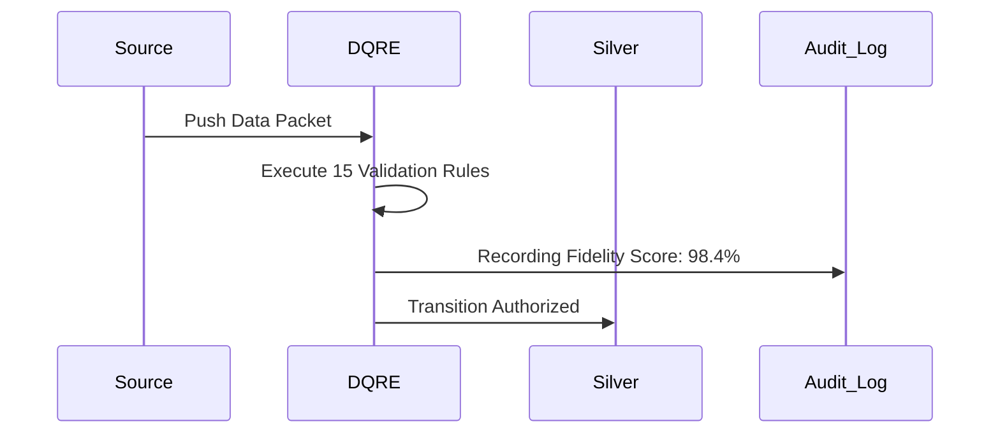

<div align="center">


<h1>Enterprise Data Platform Accelerator (EDPA)</h1>

<p><strong>The Industrial Foundation for Scalable Data Lakehouses, Medallion Architecture, and Automated Quality Governance</strong></p>

[](https://devopstrio.co.uk/)
[](/terraform)
[](/terraform)
[](https://devopstrio.co.uk/)

<br/>

> **"Data is the fuel; Quality is the engine."** The Enterprise Data Platform Accelerator (EDPA) is a production-hardened blueprint for building secure, scalable, and governed data ecosystems that power the next generation of AI and Analytics.

</div>

---

## 🏛️ Executive Summary

The **Enterprise Data Platform Accelerator (EDPA)** is a comprehensive framework designed to standardize the deployment of **Medallion Lakehouses** on Azure. By integrating automated data quality enforcement (DQRE) and network-isolated persistence layers, EDPA ensures that organizations move from "Data Swamps" to "Strategic Intelligence Hubs."

### Strategic Business Outcomes
- **Zero-Day Data Readiness**: Pre-configured pipelines to accelerate AI project onboarding.
- **Automated Quality Governance**: Real-time schema validation and quarantine logic for non-compliant data.
- **Industrial Scale**: Engineered for multi-terabyte ingestion with ZRS-redundant ADLS Gen2 backbone.
- **Regulatory Compliance**: Integrated PII detection and audit-logging for GDPR/HIPAA-ready environments.

---

## 🏗️ Technical Architecture

### 1. High-Level Blueprint


### 2. Medallion Flow & Quality Gates


### 3. Network Isolation & Private Link Boundary


---

## 🛡️ Data Quality Rules Engine (DQRE)

The platform features a proprietary **DQRE** layer that enforces integrity at the "Speed of Ingestion":

- **Level 1: Structural Integrity**: Validates file formats, encodings, and mandatory headers.
- **Level 2: Content Consistency**: Verifies data types, value ranges, and relational integrity.
- **Level 3: Compliance & Privacy**: Automated detection of PII/PHI with masking-at-source capabilities.

### Quality Reporting Workflow


---

## 📦 Global Infrastructure Stack

| Layer | Component | Technology | Priority |
|:---|:---|:---|:---:|
| **Storage** | Medallion Lakehouse | ADLS Gen2 / HNS | Foundation |
| **Ingestion** | Event-Driven | Event Hubs / Kafka | Real-Time |
| **Quality** | DQRE v2.0 | Python / Spark | Governance |
| **Processing** | Spark / SQL | Databricks / Synapse | Intelligence |
| **Networking** | Hub-Spoke | Private Link / VNet | Security |

---

## 🚀 Deployment Guide

### Terraform Orchestration
```powershell
./scripts/provision-edpa.ps1 -Tier prod
```

### 🗺️ Platform Roadmap

- **Phase 1 (Release 1.0)**: Secure ADLS Gen2 Hub-Spoke & Bronze/Silver logic.
- **Phase 2 (v1.5)**: Real-time Delta Lake conversion & Schema Evolution.
- **Phase 3 (v2.0)**: "Autonomous Data Repair"—AI-driven reconciliation of Silver-tier gaps.

---

## 🆘 Support & Consulting
Devopstrio provides dedicated **Data Platform Operations** to ensure 99.99% availability for enterprise intelligence hubs.

- **Status**: [data-status.devopstrio.co.uk](https://devopstrio.co.uk)
- **Consulting**: [data-ops@devopstrio.co.uk](mailto:data-ops@devopstrio.co.uk)

---
<sub>&copy; 2026 Devopstrio &mdash; Scaling Enterprise Data Engineering.</sub>
