<div align="center">


<h1>Enterprise Data Platform Accelerator</h1>

<p><strong>The Industry Standard for Industrialized Lakehouse Architectures and Data Mesh foundations</strong></p>

[]()
[]()
[]()
[]()

<br/>

> **"Unlocking institutional value through industrialized data foundations."** 
> Enterprise Data Platform Accelerator is a flagship repository designed to enable organizations to design, deploy, and govern modern data estates at institutional scale through secure lakehouse patterns and data mesh principles.

</div>

---

## 🏛️ Executive Summary

**Enterprise Data Platform Accelerator (EDPA)** is a flagship repository designed for Chief Data Officers (CDOs), CTOs, and Data Platform Leaders. As organizations transition from monolithic data warehouses to distributed lakehouse and data mesh architectures, the need for a standardized, secure, and automated data foundation becomes the critical path to AI and analytics readiness.

This platform provides an industrialized approach to **Modern Data Architecture**, delivering production-ready **Lakehouse Foundations**, **Medallion Refinement Pipelines**, **Unified Governance**, and **Self-Service Analytics Portals**. It supports **Databricks**, **Snowflake**, **Microsoft Fabric**, **BigQuery**, and **Redshift**, enabling organizations to transition from "Data Silos" to "Industrialized Data Value Streams."

---

## 💡 Why Enterprise Data Platforms Matter

A modern data platform is the engine of the digital enterprise:
- **Democratized Insights**: Moving from centralized bottlenecked reporting to federated, self-service analytics.
- **AI / ML Readiness**: Providing the feature pipelines and vector stores required for generative AI and predictive modeling.
- **Data Governance at Scale**: Automating security, privacy, and quality across thousands of datasets through policy-as-code.
- **Cost Transparency**: Implementing granular FinOps for data, enabling chargeback and optimization of compute/storage.

---

## 🚀 Business Outcomes

### 🎯 Strategic Data Impact
- **Accelerated Time-to-Insight**: Reducing the lead time for new data products from weeks to days through reusable blueprints.
- **Reduced Technical Debt**: Standardizing ingestion and refinement patterns across the entire institution.
- **Enhanced Data Trust**: Enforcing data quality and lineage as a foundational capability.
- **Optimized TCO**: Reducing infrastructure and operational overhead through automated platform management.

---

## 🏗️ Technical Stack

| Layer | Technology | Rationale |
|---|---|---|
| **Governance Engine** | Python, Terraform, dbt | High-performance orchestration of institutional guardrails and metadata management. |
| **Control Plane** | FastAPI | High-performance API for pipeline orchestration, catalog management, and cost tracking. |
| **Frontend** | React 18, Vite | Premium portal for executive dashboards, data cataloging, and self-service analytics. |
| **Data Targets** | Databricks, Snowflake, BigQuery | Supporting the leading multi-cloud lakehouse and warehouse platforms. |
| **Pipeline Core** | dbt, Python, Spark | Industrialized transformation and refinement of institutional data assets. |
| **Observability** | Prometheus / Grafana | Real-time monitoring of pipeline health, data quality, and platform latency. |

---

## 📐 Architecture Storytelling: 80+ Diagrams

### 1. Executive High-Level Architecture
The holistic vision of the enterprise data transformation journey.

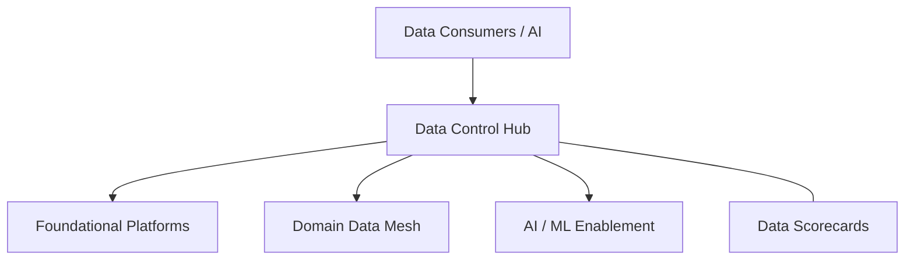

### 2. Detailed Platform Topology
The internal service boundaries and management layers of the industrialized foundation.

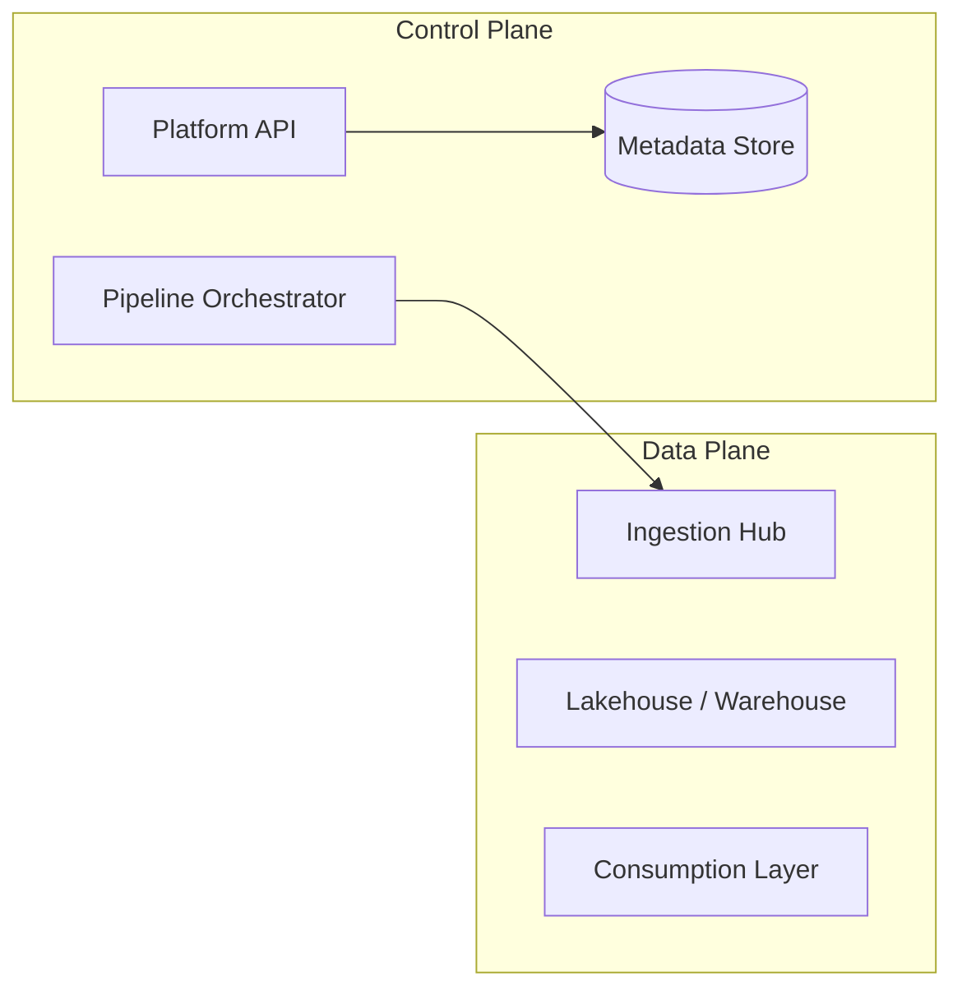

### 3. Data Producer to Consumer Path
Tracing the lifecycle of a data asset from raw source to refined insight.

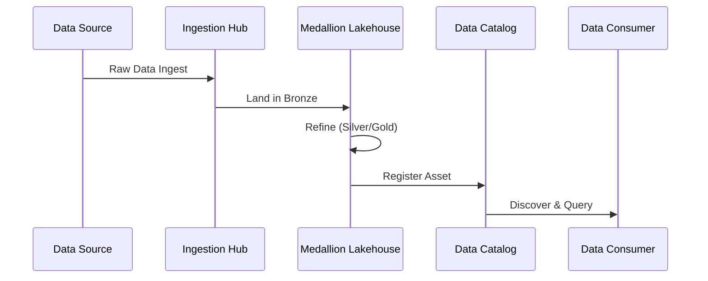

### 4. Control Plane Architecture
The "Brain" of the framework managing global data asset definitions and policies.

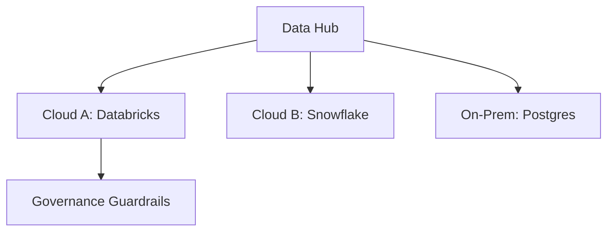

### 5. Multi-Cloud Topology
Synchronizing institutional data standards across Azure, AWS, and GCP.

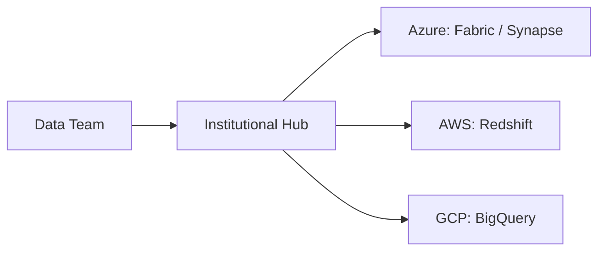

### 6. Regional Deployment Model
Hosting ingestion and compute close to the data sources for performance and cost.

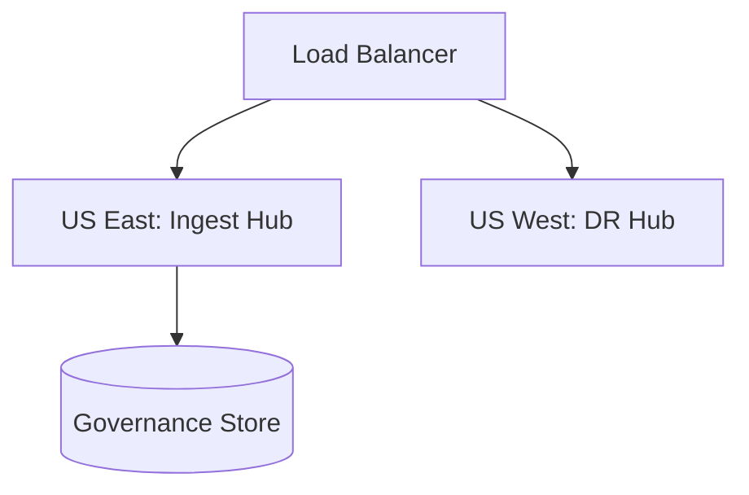

### 7. DR Failover Model
Ensuring platform continuity for critical reporting and real-time data streams.

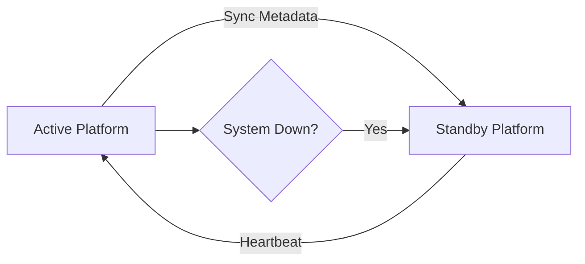

### 8. API Gateway Architecture
Securing and throttling the entry point for data orchestration and catalog access.

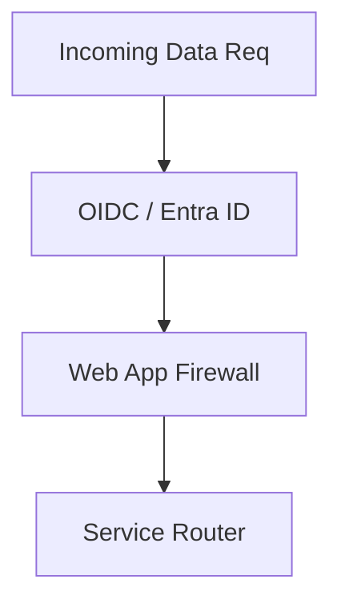

### 9. Queue Worker Architecture
Managing long-running ingestion and transformation jobs at scale.

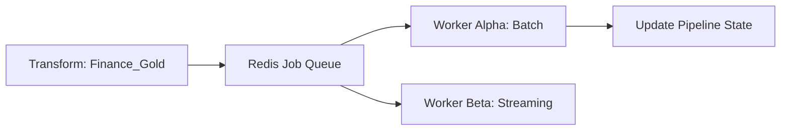

### 10. Dashboard Analytics Flow
How raw platform telemetry becomes executive data engineering scorecards.

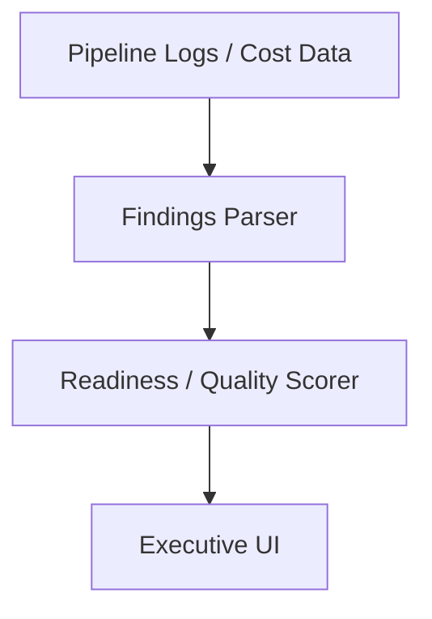

### 11. Batch Ingestion Workflow
Standardizing the reliable movement of historical data into the lakehouse.

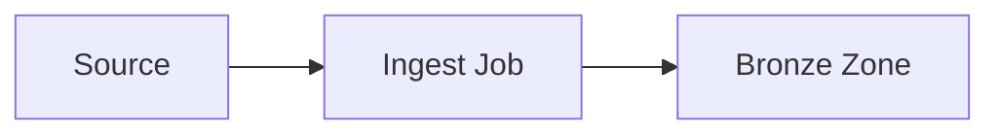

### 12. Streaming Ingestion Model
Real-time ingestion for high-velocity events via Kafka or Event Hubs.

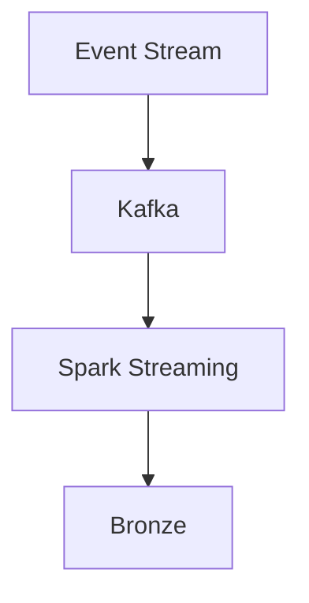

### 13. CDC Replication Pattern
Capturing database changes in real-time to keep the lakehouse synchronized.

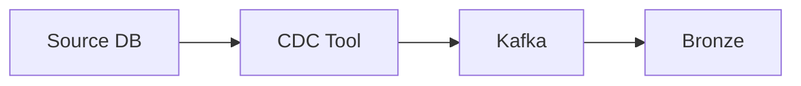

### 14. API Ingestion Flow
Securing and standardizing data retrieval from third-party SaaS APIs.

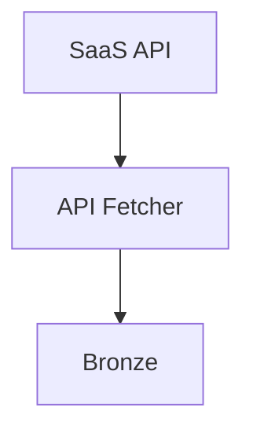

### 15. File Landing Zone Lifecycle
Managing the ingestion and cleanup of flat files in object storage.

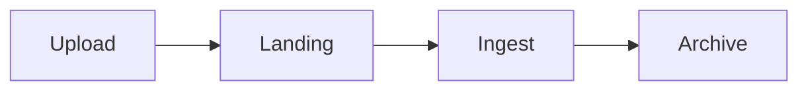

### 16. IoT Telemetry Ingestion
Handling massive, high-frequency sensor data at the edge and cloud.

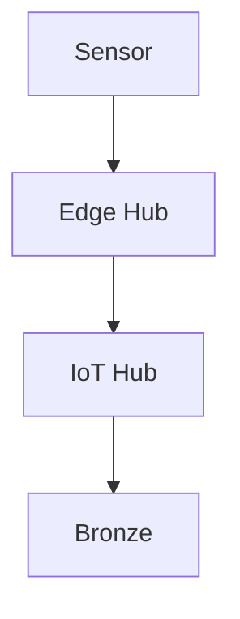

### 17. Event-Driven Pipeline Model
Triggering transformations automatically based on file arrivals or status changes.

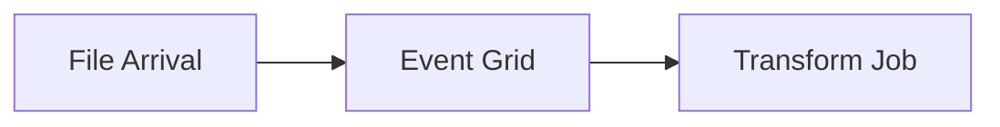

### 18. Schema Registry Workflow
Enforcing schema standards and versioning across the data estate.

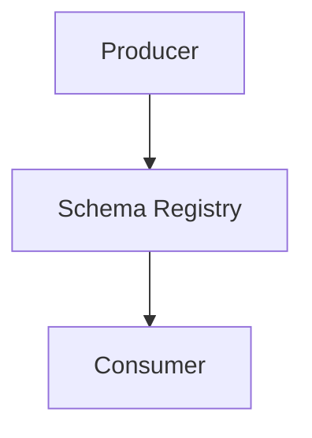

### 19. Retry / DLQ Pattern
Ensuring pipeline resilience through automated retries and Dead Letter Queues.

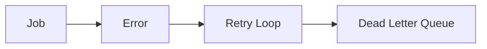

### 20. Orchestration Dependency Graph
Visualizing the complex web of dataset dependencies and job triggers.

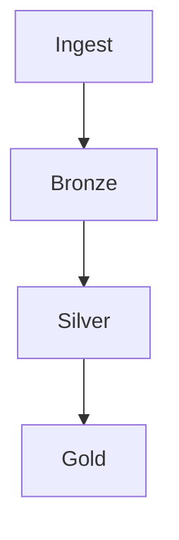

### 21. Bronze Silver Gold Architecture
The foundational Medallion architecture for data refinement.

```mermaid
graph LR
    Raw[Raw] --> Bronze[Bronze] --> Silver[Silver] --> Gold[Gold]
```

### 22. Medallion Refinement Flow
Tracing the transformation logic applied at each refinement stage.

```mermaid
graph TD
    Bronze[Bronze: Raw] --> Clean[Silver: Cleaned] --> Agg[Gold: Aggregated]
```

### 23. Warehouse Semantic Layer Model
Creating a business-friendly view of complex lakehouse datasets.

```mermaid
graph LR
    Lake[Lakehouse] --> View[Semantic Layer] --> BI[BI Tool]
```

### 24. Object Storage Zone Layout
Organizing ADLS/S3/GCS into logical zones for security and scale.

```mermaid
graph TD
    Root[Storage Root] --> Landing[Landing]
    Root --> Raw[Raw]
    Root --> Curated[Curated]
```

### 25. Partitioning Strategy
Optimizing query performance through intelligent data layout.

```mermaid
graph LR
    Data[Data] --> Part[Year / Month / Day]
```

### 26. Small Files Optimization Model
Automatically compacting small files to prevent "Small File Problem" in Spark.

```mermaid
graph TD
    Small[Small Files] --> Compact[Compaction Job] --> Large[Optimized Parquet]
```

### 27. Time Travel / Snapshot Model
Accessing historical versions of data through Delta Lake or Iceberg snapshots.

```mermaid
graph LR
    Query[Query] --> Snapshot[V1 / V2 / V3]
```

### 28. Data Retention Lifecycle
Automating the archiving and deletion of data based on compliance rules.

```mermaid
graph LR
    Active[Active] --> Cool[Cool] --> Archive[Archive] --> Delete[Delete]
```

### 29. Backup Archive Workflow
Ensuring multi-region data durability for disaster recovery.

```mermaid
graph TD
    Lake[Lake] --> Backup[Backup Store] --> Remote[Remote Region]
```

### 30. Cross-Region Replication Model
Syncing datasets globally for local low-latency access.

```mermaid
graph LR
    RegionA[East US] <-> Sync[Geo Sync] <-> RegionB[West US]
```

### 31. Catalog Ownership Model
Defining who owns and manages metadata across the institution.

```mermaid
graph TD
    Owner[Business Owner] --> Meta[Catalog Entry]
```

### 32. Unity Catalog Style Permissions
Implementing unified, attribute-based access control (ABAC) for data.

```mermaid
graph LR
    User[User] --> UC[Unity Catalog] --> Asset[Data Asset]
```

### 33. RBAC Model
Defining granular roles for Data Engineers, Scientists, and Analysts.

```mermaid
graph TD
    Role[Data Scientist] --> Perm[Read Silver/Gold]
```

### 34. ABAC Tag Governance
Securing data based on classification tags (e.g., PII, Restricted).

```mermaid
graph LR
    Tag[PII] --> Policy[Deny External Access]
```

### 35. Row-Level Security Flow
Filtering data results dynamically based on user identity or region.

```mermaid
graph TD
    User[User: EMEA] --> Query[Select] --> Filter[Region = EMEA]
```

### 36. Column Masking Workflow
Protecting sensitive data fields through automated masking.

```mermaid
graph LR
    Raw[Email: foo@bar.com] --> Mask[f***@bar.com]
```

### 37. Sensitive data discovery model
Automatically scanning datasets for hidden PII or security risks.

```mermaid
graph TD
    Scan[Scan] --> PII[PII Detected] --> Alert[Alert / Tag]
```

### 38. Audit Logging Architecture
Centralized tracking of every data access and modification.

```mermaid
graph LR
    Action[Query] --> Log[Audit Hub]
```

### 39. Privacy Boundary Model
Enforcing regional data residency and privacy rules (GDPR / CCPA).

```mermaid
graph TD
    EU[EU Boundary] --- US[US Boundary]
```

### 40. Key Management Workflow
Managing the encryption keys for data at rest and in transit.

```mermaid
graph TD
    Data[Data] --> KV[Key Vault]
```

### 41. BI Dashboard Access Model
Governing how executive reports are shared and secured.

```mermaid
graph LR
    Dash[Dashboard] --> Group[Finance AD Group]
```

### 42. Self-service SQL Workflow
Empowering analysts to query the lakehouse through secure SQL endpoints.

```mermaid
graph TD
    Analyst[Analyst] --> SQL[SQL Warehouse] --> Results[Data]
```

### 43. Semantic Model Architecture
Standardizing business logic (metrics/KPIs) across the platform.

```mermaid
graph LR
    Logic[Metric: Revenue] --> Model[Semantic Hub] --> Tools[BI / Apps]
```

### 44. Notebook Analytics Lifecycle
Standardizing the promotion of notebooks from Sandbox to Production.

```mermaid
graph LR
    SBX[Sandbox] --> PR[Code Review] --> PROD[Scheduled Job]
```

### 45. Reverse ETL Pattern
Syncing refined data from the lakehouse back into business apps (CRM/ERP).

```mermaid
graph TD
    Gold[Gold Data] --> Sync[Reverse ETL] --> CRM[Salesforce]
```

### 46. Data API Product Model
Exposing refined datasets as secure, versioned REST/GraphQL APIs.

```mermaid
graph LR
    API[Data API] --> App[Consumer App]
```

### 47. Federated Query Workflow
Joining data across different platforms (e.g., Snowflake + Databricks) in real-time.

```mermaid
graph TD
    Query[Query] --> Bridge[Query Bridge] --> Targets[Platforms]
```

### 48. Search Analytics Flow
Enabling natural language search over the institutional data catalog.

```mermaid
graph LR
    Search[Search: Sales] --> Cat[Catalog] --> Result[Datasets]
```

### 49. Executive KPI Scorecard Model
Visualizing institutional performance metrics in a unified dashboard.

```mermaid
graph TD
    Logic[KPI Hub] --> Scorecard[Executive UI]
```

### 50. Embedded Analytics Pattern
Integrating data visualizations directly into internal enterprise portals.

```mermaid
graph LR
    Portal[Portal] --> Embed[Embedded Chart]
```

### 51. Feature Store Architecture
Managing and serving ML features for training and inference.

```mermaid
graph TD
    Ingest[Pipeline] --> FS[Feature Store] --> Model[ML Model]
```

### 52. ML Training Data Pipeline
Automating the creation of high-quality training sets for ML models.

```mermaid
graph LR
    Raw[Data] --> Prep[Prep Job] --> Set[Training Set]
```

### 53. Batch Inference Workflow
Running large-scale model predictions on historical data.

```mermaid
graph TD
    Set[Data Set] --> Model[Inference Job] --> Result[Predictions]
```

### 54. Real-time Inference Model
Serving low-latency ML predictions via secure model endpoints.

```mermaid
graph LR
    Req[Req] --> EP[Model Endpoint] --> Res[Pred]
```

### 55. MLOps Promotion Flow
The CI/CD journey for machine learning models from Dev to Prod.

```mermaid
graph LR
    Train[Train] --> Test[Test] --> Registry[Registry] --> Deploy[Deploy]
```

### 56. Vector Search Architecture
Enabling similarity search for GenAI and recommendation engines.

```mermaid
graph TD
    Embed[Embeddings] --> Vector[Vector DB] --> Query[Search]
```

### 57. RAG Data Platform Integration
Feeding institutional knowledge into LLMs via Retrieval Augmented Generation.

```mermaid
graph LR
    Doc[Docs] --> Chunk[Chunker] --> Vector[Vector DB] <-> LLM[LLM]
```

### 58. Model Monitoring Workflow
Tracking model drift and performance in production environments.

```mermaid
graph TD
    Pred[Preds] --> Monitor[Drift Monitor] --> Alert[Alert]
```

### 59. AI Governance Lifecycle
Governing the ethics, security, and usage of AI models across the estate.

```mermaid
graph LR
    Req[AI Project] --> Review[Ethical Review] --> Auth[Auth]
```

### 60. Experiment Tracking Model
Centralizing the history of ML experiments and hyperparameters.

```mermaid
graph TD
    Run[Run] --> Tracker[MLflow / Weights & Biases]
```

### 61. Capacity Planning Workflow
Predicting future data compute and storage needs based on growth.

```mermaid
graph TD
    Trend[Usage Trend] --> Forecast[Capacity Needs]
```

### 62. Cost Allocation Model
Attributing data platform costs to specific business units or projects.

```mermaid
graph LR
    Bill[Cloud Bill] --> Assign[Dept: Marketing]
```

### 63. Chargeback / showback Workflow
Visualizing departmental data consumption for financial accountability.

```mermaid
graph TD
    Report[Usage Report] --> Dept[Business Lead]
```

### 64. Query Performance Optimization
Automatically identifying and tuning expensive queries.

```mermaid
graph LR
    Slow[Slow Query] --> Advisor[Tuning Guide]
```

### 65. Workload Isolation Model
Separating high-priority reporting from ad-hoc analysis workloads.

```mermaid
graph TD
    Compute[Shared Compute] --> Pool[Reporting Pool]
    Compute --> Pool[Ad-Hoc Pool]
```

### 66. Metrics Pipeline
Monitoring the performance of data platforms and pipeline health.

```mermaid
graph TD
    Hub[Hub] --> Prom[Prometheus]
```

### 67. Logging Architecture
The unified path for telemetry from pipelines to central operations.

```mermaid
graph LR
    Log[Pipeline Log] --> Forwarder[Forwarder] --> Hub[Loki/Elastic]
```

### 68. Tracing Model
Observing distributed data requests across complex mesh architectures.

```mermaid
graph TD
    API[API] --> Pipeline[Pipeline] --> Lake[Lake]
```

### 69. Incident Response Workflow
Standardized steps for handling a data breach or pipeline outage.

```mermaid
graph TD
    Event[Event] --> Assess[Assess] --> Contain[Contain]
```

### 70. Change Management Model
Standardizing changes to core institutional data infrastructure.

```mermaid
graph TD
    Req[Change Req] --> CAB[Review Board] --> Execute[Approve]
```

### 71. Domain Ownership Topology
Mapping data products to the business domains that own them.

```mermaid
graph TD
    Domain[Finance] --> Product[Ledger Data Product]
```

### 72. Data Mesh Operating Model
The federated organizational structure for modern data management.

```mermaid
graph LR
    Central[Platform Team] <-> DomainA[Domain A] <-> DomainB[DomainB]
```

### 73. Data Steward Workflow
The day-to-day lifecycle of a domain data steward.

```mermaid
graph TD
    Req[New Data] --> Review[Steward Review] --> Catalog[Approve]
```

### 4. Executive Review Cadence
The monthly review of data strategy and ROI for the leadership team.

```mermaid
graph LR
    Stats[Stats] --> Deck[Executive Summary]
```

### 75. Quarterly Roadmap Cycle
Aligning data platform evolution with the institutional business cycle.

```mermaid
graph TD
    Q1[Build] --> Q2[Scale]
```

### 76. Vendor Integration Model
Managing the integration of multiple data vendors into a unified platform.

```mermaid
graph LR
    V1[Databricks] --- Hub[EDPA Hub] --- V2[Snowflake]
```

### 77. Multi-country Governance Model
Governing global data assets under a single institutional framework.

```mermaid
graph TD
    HQ[HQ] --> SiteA[London] --> SiteB[Singapore]
```

### 78. Data Maturity Roadmap
The journey from "Manual Data" to "Industrialized Data Intelligence."

```mermaid
graph LR
    S1[Ad-Hoc] --> S4[Autonomous Intelligence]
```

### 79. Training Enablement flow
The path for upskilling the workforce on the modern data platform.

```mermaid
graph LR
    Learn[Training] --> Cert[Certification] --> Practice[Project]
```

### 80. Continuous Improvement Loop
The ultimate feedback cycle for institutional data excellence.

```mermaid
graph LR
    Test[Test] --> Learn[Learn] --> Evolve[Evolve]
    Evolve --> Test
```

---

## 🔬 Institutional Data Methodology

### 1. The Lakehouse Evolution
The Lakehouse architecture combines the performance and reliability of a data warehouse with the scale and flexibility of a data lake. Our platform standardizes this through:
- **Medallion Refinement**: Bronze (Raw), Silver (Cleaned), Gold (Aggregated).
- **Unity Governance**: A single control plane for all metadata and security.
- **Engine Agnostic**: Switch between Spark, SQL, and Python with zero friction.

### 2. Data Mesh & Domain Ownership
We move away from a centralized "bottleneck" data team towards a federated model where domains (Finance, HR, Sales) own their data products, supported by a central platform team.

---

## 🚦 Getting Started

### 1. Prerequisites
- **Terraform** (v1.5+).
- **Docker** & **Kubernetes**.
- **Python 3.10+**.

### 2. Local Setup
```bash
# Clone the repository
git clone https://github.com/Devopstrio/enterprise-data-platform-accelerator.git
cd enterprise-data-platform-accelerator

# Start the Data Governance Control Plane
docker-compose up --build
```
Access the Dashboard at `http://localhost:3000`.

---

## 🛡️ Governance & Security
- **Identity First**: Deep integration with OIDC and Entra ID for unified data access.
- **Policy as Code**: Every data asset and pipeline is governed by institutional policy.
- **Quality as a Service**: Automated dbt tests and quality scoring for every dataset.

---
<sub>&copy; 2026 Devopstrio &mdash; Engineering the Future of Industrialized Data Foundations.</sub>
