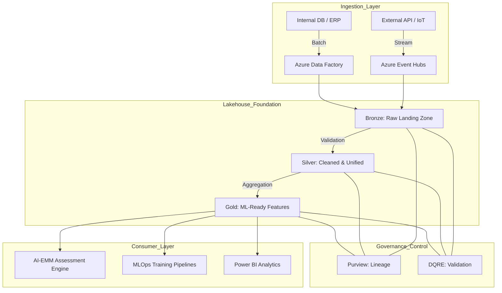
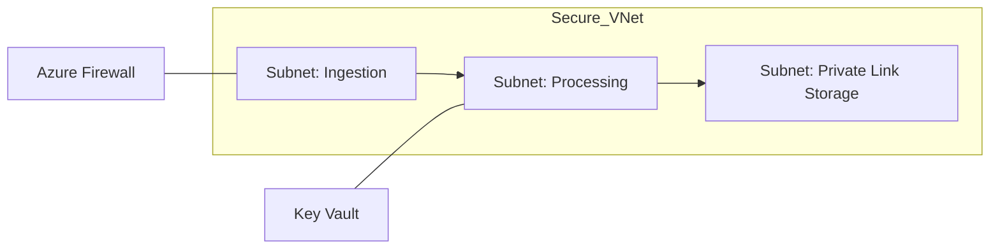

<div align="center">


<h1>Enterprise Data Platform Accelerator (EDPA)</h1>

<p><strong>High-Performance Cloud Foundation &middot; Governed Lakehouse Architecture &middot; Real-Time AI Readiness</strong></p>

[](https://devopstrio.co.uk/)
[](/terraform)
[](/terraform)
[](https://devopstrio.co.uk/)

<br/>

> **"Data is the fuel for AI, but only if it's refined."** The EDPA is a production-grade foundation designed to accelerate the transition from raw data to ML-ready features, providing the industrial-scale infrastructure required for enterprise AI transformation.

</div>

---

## 📈 Strategic Portfolio Alignment

The EDPA serves as the **Foundation Layer** in the Devopstrio Enterprise Stack. It is specifically designed to remediate the "Data Readiness" gaps identified by the [AI Engineering Maturity Model (AI-EMM)](https://github.com/Devopstrio/ai-engineering-maturity-model).

| Maturity Gap (AI-EMM) | EDPA Implementation Solution | Maturity Level Target |
|:---|:---|:---:|
| **No Data Governance** | Microsoft Purview + Automated Lineage | Level 4 |
| **Poor Data Quality** | Data Quality Rules Engine (DQRE) Validation | Level 5 |
| **Batch-only Ingestion** | Event-Driven Streaming Engine (Event Hubs/Kafka) | Level 4 |
| **Monolithic Storage** | Medallion Lakehouse Architecture (Bronze/Silver/Gold) | Level 5 |

---

## 🏛️ High-Performance Architecture

The EDPA implements a **Zero-Trust, Event-Driven Lakehouse** that spans internal and external datasets.



---

## ✨ Core Product Pillars

### 🌊 Medallion Data Lifecycle
Synchronized lifecycle management for your data lakehouse:
- **Bronze (Immutable)**: Capturing raw fidelity with infinite retention.
- **Silver (Unified)**: Schema enforcement, deduplication, and PII masking.
- **Gold (Optimized)**: High-performance columnar formats (Parquet/Delta) for AI training.

### 🛡️ Secure-by-Default (Zero-Trust)
- **VNet Isolation**: All data processing nodes operate within a private network boundary.
- **Private Link Integration**: Storage accounts and compute runtimes use Private Endpoints.
- **Managed Identities**: System-driven access control replacing legacy connection strings.

### ⚙️ Governance-as-Code
- **Automated Cataloging**: Native integration with Microsoft Purview for metadata discovery.
- **Quality Gates**: CI/CD for data pipelines that enforce "Schema Contracts" before ingestion.

---

## 📦 Infrastructure-as-Code (Expert Tier)

### Terraform Blueprint
```hcl
module "lakehouse" {
  source      = "./modules/lakehouse"
  environment = "prod"
  tier        = "Performance" # Optane-accelerated / NVMe tiers
}
```

### Deployment Topology


---

## 🚀 DevOps & Operational Readiness
- **CI/CD Pipelines**: Pre-built YAML templates for Azure DevOps and GitHub Actions.
- **Observability**: Built-in dashboards for Cost-per-Ingestion and Data Freshness.
- **FinOps**: Automatic lifecycle policies to move cold data to "Archive" tiers.

---

## 🆘 Enterprise Support
Devopstrio provides managed transition services for organizations migrating from Level 2 to Level 5 maturity.

- **Consulting**: [edpa-support@devopstrio.co.uk](mailto:edpa-support@devopstrio.co.uk)
- **Portfolio**: [devopstrio.co.uk/portfolio](https://devopstrio.co.uk/portfolio)

---
<sub>&copy; 2026 Devopstrio &mdash; The Foundation for Enterprise AI.</sub>
