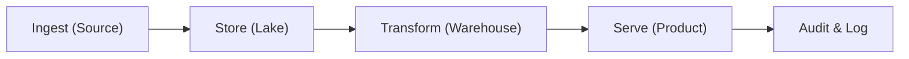
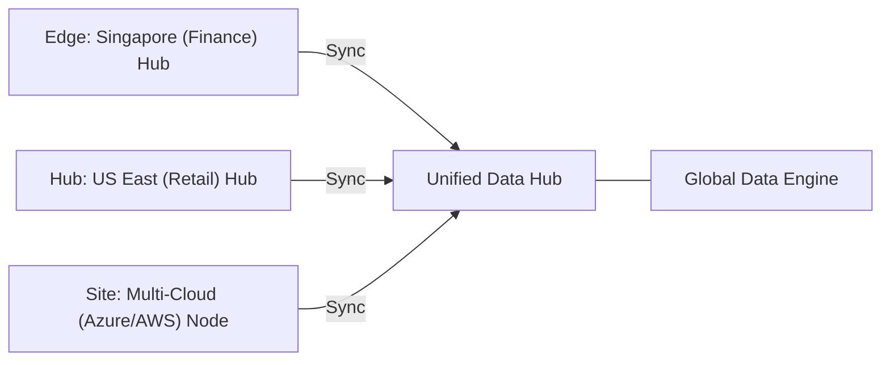
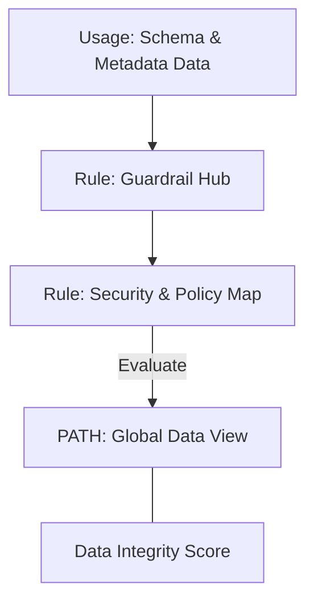
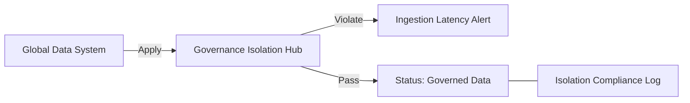
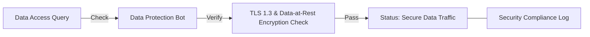
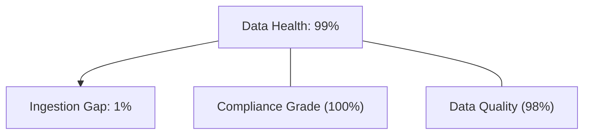
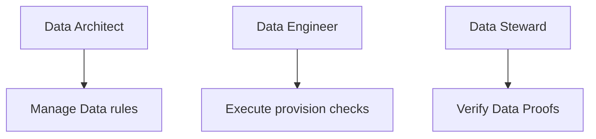
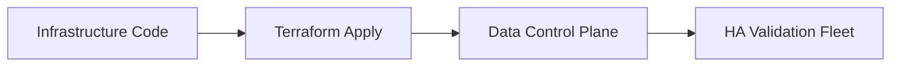
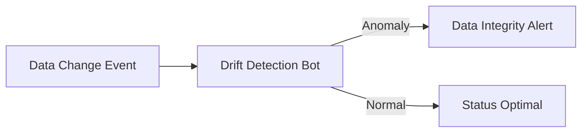
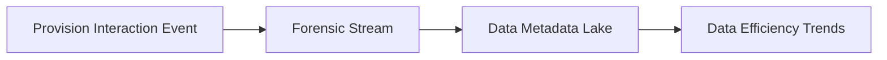

<div align="center">


<h1>Enterprise Data Platform Accelerator</h1>

<p><strong>The Institutional-Grade Platform for Standardized Data Foundations, Lakehouse Orchestration Governance, and Multi-Cloud Data Ecosystem Delivery.</strong></p>

[]()
[]()
[]()

<br/>

> **"Industrializing data delivery to automate lakehouse foundations."** 
> **Enterprise Data Platform Accelerator (EDPA)** is an enterprise-grade platform designed to provide a secure, measurable, and highly automated foundation for global data operations. It orchestrates the complex lifecycle of data—from source ingestion and storage in the lakehouse to refined transformation and unified data auditing.

</div>

---

## 🏛️ Executive Summary

Fragmented data silos and manual pipeline workflows are strategic operational liabilities; lack of centralized data orchestration is a primary barrier to organizational cloud maturity. Organizations fail to maintain a secure data foundation not because of a lack of databases, but because of fragmented data standards, lack of automated schema validation, and an inability to orchestrate data planes with operational precision.

This platform provides the **Data Intelligence Plane**. It implements a complete **Enterprise Data-Platform-Accelerator-as-Code Framework**, enabling Data and Platform teams to manage global data foundations as first-class citizens. By automating the identification of ingestion bottlenecks through real-time telemetry analysis and orchestrating the deployment of secure performance-driven data policies, we ensure that every organizational service—from core data lakes to distributed data products—is governed by default, audited for history, and strictly aligned with institutional data frameworks.

---

## 📐 Architecture Storytelling: Principal Reference Models

### 1. Principal Architecture: Global Enterprise Data Platform Accelerator & Data Intelligence Plane
This diagram illustrates the end-to-end flow from data ingestion and multi-cloud orchestration to schema enforcement, quality validation, and institutional data auditing.


```mermaid
graph LR
    %% Subgraph Definitions
    subgraph DataIngress["Source & Ingestion Ingress"]
        direction TB
        Relational_DBs["SQL Server / Oracle / Postgres"]
        SaaS_Apps["Salesforce / SAP / ServiceNow"]
        Event_Streams["Kafka / Event Hub / IoT Hubs"]
    end

    subgraph IntelligenceEngine["Data Intelligence Hub"]
        direction TB
        API["FastAPI Data Gateway"]
        DataOrchestrator["Global Lakehouse & Schema Hub"]
        Governance_Hub["Compliance & Contract Guardrail Hub"]
        AIOps_Validator["Drift & Quality Analysis Hub"]
    end

    subgraph OperationsPlane["Distributed Data Ecosystem"]
        direction TB
        ManagedLakehouses["Managed Standardized Lakehouses"]
        ActivePipelines["Managed Automated Data Pipelines"]
        DataSinks["Managed Infrastructure Delivery Hubs"]
    end

    subgraph OperationsHub["Institutional Data Hub"]
        direction TB
        Scorecard["Data Maturity Scorecard"]
        Analytics["Data Flow & Readiness Velocity Stats"]
        Audit["Forensic Data Metadata Lake"]
    end

    subgraph DevOps["Enterprise-Data-Platform-Accelerator-as-Code Framework"]
        direction TB
        TF["Terraform Data Modules"]
        DriftBot["Data & Config Drift Validator"]
        ChatOps["Data Operations Hub"]
    end

    %% Flow Arrows
    DataIngress -->|1. Submit Source| API
    API -->|2. Orchestrate Ingestion| DataOrchestrator
    DataOrchestrator -->|3. Apply Schema Guard| Governance_Hub
    Governance_Hub -->|4. Assess Drift| AIOps_Validator
    
    AIOps_Validator -->|5. Execute Provision| OperationsPlane
    OperationsPlane -->|6. Notify Status| ChatOps
    API -->|7. Visualize Health| Scorecard
    
    Scorecard -->|8. Track Maturity| Analytics
    Scorecard -->|9. Record Provision| Audit
    
    TF -->|10. Provision Backbone| IntelligenceEngine
    DriftBot -->|11. Inject Ingestion Risk| DataOrchestrator
    Audit -->|12. Improve Operations| ManagedLakehouses

    %% Styling
    classDef ingress fill:#f5f5f5,stroke:#616161,stroke-width:2px;
    classDef intel fill:#e8eaf6,stroke:#1a237e,stroke-width:2px;
    classDef operations fill:#e1f5fe,stroke:#01579b,stroke-width:2px;
    classDef ops fill:#ede7f6,stroke:#311b92,stroke-width:2px;
    classDef devops fill:#e8f5e9,stroke:#1b5e20,stroke-width:2px;

    class DataIngress ingress;
    class IntelligenceEngine intel;
    class OperationsPlane operations;
    class OperationsHub ops;
    class DevOps devops;
```

### 2. The Data Lifecycle Flow
The continuous path of an infrastructure platform from initial ingest (source) and store (lake) to active transform (warehouse), serve (product), and institutional forensic auditing.


```mermaid
graph LR
    Ingest["Ingest (Source)"] --> Store["Store (Lake)"]
    Store --> Transform["Transform (Warehouse)"]
    Transform --> Serve["Serve (Product)"]
    Serve --> Audit["Audit & Log"]
```

### 3. Distributed Data Mesh Topology
Strategically orchestrating standardized data products across global cloud regions, diverse business domains, and multi-cloud targets, providing a unified institutional view of global data health and operational readiness.


```mermaid
graph LR
    RegionA["Edge: Singapore (Finance) Hub"] -->|Sync| Hub["Unified Data Hub"]
    BU["Hub: US East (Retail) Hub"] -->|Sync| Hub
    Cloud["Site: Multi-Cloud (Azure/AWS) Node"] -->|Sync| Hub
    Hub --- Logic["Global Data Engine"]
```

### 4. Data Governance & High-Trust Data Plane Protection Flow
Executing complex logic for securing the bridge between data producers and analytical consumers, ensuring every organizational identity is verified and every data access is according to institutional standards.


```mermaid
graph TD
    DataProduct["Usage: Schema & Metadata Data"] --> Bridge["Rule: Guardrail Hub"]
    Bridge --> ContractMap["Rule: Security & Policy Map"]
    ContractMap -->|Evaluate| Context["PATH: Global Data View"]
    Context --- Estimate["Data Integrity Score"]
```

### 5. Multi-Cloud Data Federation & Governance Flow
Automatically managing unified data standards across global regions and diverse data platforms, ensuring institutional data residency and security boundaries by default.


```mermaid
graph LR
    Org["Global Data System"] -->|Apply| Guard["Governance Isolation Hub"]
    Guard -->|Violate| Alert["Ingestion Latency Alert"]
    Guard -->|Pass| Verify["Status: Governed Data"]
    Verify --- Audit["Isolation Compliance Log"]
```

### 6. Encryption & Perimeter Protection Flow (Data Standard)
Managing the lifecycle of a data request, automatically enforcing institutional TLS 1.3 and data-at-rest encryption standards as required by security policy, ensuring zero-latency security confidence.


```mermaid
graph LR
    DataReq["Data Access Query"] -->|Check| Gatekeeper["Data Protection Bot"]
    Gatekeeper -->|Verify| TLS["TLS 1.3 & Data-at-Rest Encryption Check"]
    TLS -->|Pass| Admit["Status: Secure Data Traffic"]
    Admit --- Audit["Security Compliance Log"]
```

### 7. Institutional Data Maturity Scorecard
Grading organizational performance based on key indicators: Schema Compliance Grade, Data Quality Index, and Security Baseline Adoption Index.


```mermaid
graph TD
    Post["Data Health: 99%"] --> Risk["Ingestion Gap: 1%"]
    Post --- C1["Compliance Grade (100%)"]
    Post --- C2["Data Quality (98%)"]
```

### 8. Identity & RBAC for Data Governance
Managing fine-grained access to data hubs, provisioning workers, and audit logs between Data Architects, Data Engineers, and Data Stewards.


```mermaid
graph TD
    Architect["Data Architect"] --> Hub["Manage Data rules"]
    Engineer["Data Engineer"] --> Exec["Execute provision checks"]
    Steward["Data Steward"] --> Audit["Verify Data Proofs"]
```

### 9. IaC Deployment: Enterprise-Data-Platform-Accelerator-as-Code Framework
Using modular Terraform to deploy and manage the versioned distribution of the data tracking hubs, contract protection workers, and forensic metadata lakes.


```mermaid
graph LR
    HCL["Infrastructure Code"] --> TF["Terraform Apply"]
    TF --> Engine["Data Control Plane"]
    Engine --> Clusters["HA Validation Fleet"]
```

### 10. AIOps Data Drift & Risk Validation Flow
Using advanced analytics to identify sudden surges in data volume, unauthorized schema changes, suspicious configuration drifts, or unusual data pattern changes that could result in institutional risk.


```mermaid
graph LR
    Drift["Data Change Event"] --> Analyzer["Drift Detection Bot"]
    Analyzer -->|Anomaly| Alert["Data Integrity Alert"]
    Analyzer -->|Normal| Pass["Status Optimal"]
```

### 11. Metadata Lake for Forensic Data Audit
Storing long-term records of every data product generated (metadata), every security event recorded, and every data lineage history for institutional record-keeping, compliance auditing, and post-provisioning forensics.


```mermaid
graph LR
    Provision["Provision Interaction Event"] --> Stream["Forensic Stream"]
    Stream --> Lake["Data Metadata Lake"]
    Lake --> Trends["Data Efficiency Trends"]
```

---

## 🏛️ Core Governance Pillars

1.  **Unified Foundation Coordination**: Maximizing resilience by centralizing all data measurement through a single institutional plane.
2.  **Automated Lakehouse Provisioning**: Eliminating "manual data silos" through proactive orchestration and pattern verification.
3.  **Sequential Schema Intelligence**: Ensuring zero-interruption operations through dependency-aware schema-driven data engineering.
4.  **Zero-Trust Contract Protection**: Automatically enforcing identity-based access and rule evaluation across all data tiers.
5.  **Autonomous Operations Logic**: Guaranteeing reliability through automated industry-specific data monitoring runbooks.
6.  **Full Data Auditability**: Immutable recording of every schema change and data provision for institutional forensics.

---

## 🛠️ Technical Stack & Implementation

### Data Engine & APIs
*   **Framework**: Python 3.11+ / FastAPI.
*   **Performance Engine**: Custom Python-based logic for multi-cloud data provisioning and DORA-style readiness metrics.
*   **Integrations**: Native connectors for Databricks, Snowflake, Azure Fabric, and AWS Redshift APIs.
*   **Persistence**: PostgreSQL (Data Ledger) and Redis (Live Contract State).
*   **Auth Orchestrator**: Federated OIDC/SAML for least-privilege data management access.

### Governance Dashboard (UI)
*   **Framework**: React 18 / Vite.
*   **Theme**: Dark, Slate, Indigo (Modern high-fidelity data aesthetic).
*   **Visualization**: D3.js for data topologies and Recharts for readiness velocity analytics.

### Infrastructure & DevOps
*   **Runtime**: AWS EKS or Azure Kubernetes Service (AKS) for management plane.
*   **Data Hub**: Managed event sourcing for immutable data security timeline reconstruction.
*   **IaC**: Modular Terraform for deploying the data landing zone and validation fleet.

---

## 🏗️ IaC Mapping (Module Structure)

| Module | Purpose | Real Services |
| :--- | :--- | :--- |
| **`infrastructure/data_hub`** | Central management plane | EKS, PostgreSQL, Redis |
| **`infrastructure/enforcers`** | Distributed data provisioners | Databricks, Snowflake, Fabric APIs |
| **`infrastructure/source_pipes`** | Data Ingestion Hubs | Webhooks, Lambda |
| **`infrastructure/auditing`** | Forensic data sinks | S3, Athena, Quicksight |

---

## 🚀 Deployment Guide

### Local Principal Environment
```bash
# Clone the landing zone platform
git clone https://github.com/devopstrio/enterprise-data-platform-accelerator.git
cd enterprise-data-platform-accelerator

# Configure environment
cp .env.example .env

# Launch the EDPA stack
make init

# Trigger a mock schema update and automated contract validation simulation
make simulate-edpa
```

Access the Management Portal at `http://localhost:3000`.

---

## 📜 License
Distributed under the MIT License. See `LICENSE` for more information.

---
<div align="center">
  <p>© 2026 Devopstrio. All rights reserved.</p>
</div>
